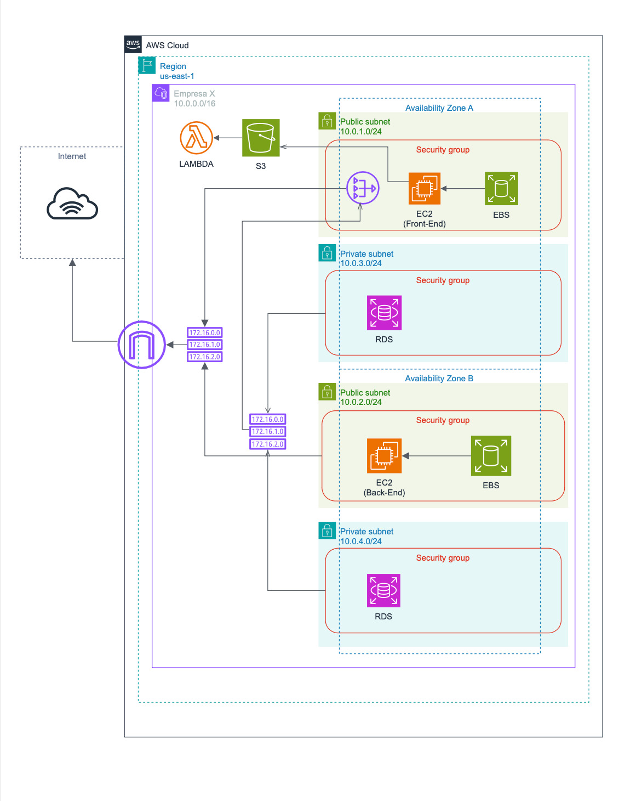

# Estudo de Caso: Empresa X - Expansão para a Nuvem

Documento de referência para o projeto da disciplina de Cloud Computing do Centro Universitário de Brasília - CEUB.

---

## a) Contexto

A **Empresa X** é uma startup de e-commerce em rápido crescimento que decidiu migrar parte de sua infraestrutura para a nuvem a fim de aproveitar a escalabilidade, alta disponibilidade e segurança que a nuvem proporciona.

A empresa necessita de uma solução que inclua:

- Uma rede segura
- Servidores web e de banco de dados
- Armazenamento persistente para os dados das aplicações

---

## b) Requisitos da Infraestrutura

### VPC (Virtual Private Cloud)
- Criar uma VPC com CIDR block `10.0.0.0/16` para isolar o ambiente de rede.

### Sub-redes
- **Públicas**:
  - Sub-rede Pública 1: `10.0.1.0/24` (Zona de Disponibilidade A)
  - Sub-rede Pública 2: `10.0.2.0/24` (Zona de Disponibilidade B)
- **Privadas**:
  - Sub-rede Privada 1: `10.0.3.0/24` (Zona de Disponibilidade A)
  - Sub-rede Privada 2: `10.0.4.0/24` (Zona de Disponibilidade B)

### Internet Gateway
- Anexar um Internet Gateway à VPC para permitir acesso à internet pelas sub-redes públicas.

### Roteamento
- Sub-redes públicas: acesso direto ao Internet Gateway.
- Sub-redes privadas: utilizar **NAT Gateway** para acesso à internet.

### NAT Gateway
- Criar um NAT Gateway na Sub-rede Pública 1 (`10.0.1.0/24`).

### Grupos de Segurança
- **Instâncias EC2 Públicas**:
  - Permitir tráfego HTTP (80), HTTPS (443) e SSH (22) apenas dos administradores.
- **Banco de Dados RDS**:
  - Permitir acesso **somente** das instâncias EC2.

### Instâncias EC2
- Criar instâncias EC2 nas sub-redes públicas como servidores web e de aplicação.
- Anexar volumes **EBS** para armazenamento persistente.

### Banco de Dados
- Utilizar **Amazon RDS** em sub-redes privadas.
- Configurar modo **Multi-AZ** para alta disponibilidade.

### AWS Lambda
- Criar função que envia e-mail de confirmação de pedido.
- Acionada por evento S3 quando um arquivo é carregado em um bucket S3.

---

## c) Função das Instâncias EC2 e Lambda

### EC2 (Sub-redes Públicas)
- Hospedagem da aplicação web
- Receber tráfego HTTP/HTTPS
- Processamento da lógica de negócio
- Comunicação com RDS
- Salvar arquivos JSON de pedidos no bucket S3
- Acesso SSH para administração

### Lambda
- Envia e-mail de confirmação quando um pedido é salvo no S3

---

## d) Distribuição dos Recursos

### Sub-redes Públicas (`10.0.1.0/24` e `10.0.2.0/24`)
- Instâncias EC2 (Servidores Web/Aplicação)
- NAT Gateway

### Sub-redes Privadas (`10.0.3.0/24` e `10.0.4.0/24`)
- Banco de Dados RDS (modo Multi-AZ)

---

## e) Instruções de Implementação

### 1. Criação da VPC e Sub-redes
- VPC: `10.0.0.0/16`
- Sub-redes:
  - Públicas: `10.0.1.0/24`, `10.0.2.0/24`
  - Privadas: `10.0.3.0/24`, `10.0.4.0/24`

### 2. Configuração dos Gateways
- Internet Gateway: anexado à VPC
- NAT Gateway: criado na Sub-rede Pública 1

### 3. Tabelas de Roteamento
- Sub-redes públicas → Internet Gateway
- Sub-redes privadas → NAT Gateway

### 4. Grupos de Segurança
- Criar e associar conforme requisitos de acesso

### 5. Instâncias EC2
- Lançar instâncias nas sub-redes públicas
- Anexar volumes EBS
- Configurar aplicação web e gravação no S3

### 6. RDS
- Criar instância Multi-AZ em sub-redes privadas
- Permitir acesso apenas das EC2 públicas

### 7. AWS Lambda
- Criar bucket S3: `pedido-novo`
- Criar função Lambda acionada por upload no bucket
- Usar Amazon SES para envio de e-mail

---

## f) Detalhes da Função AWS Lambda

### 1. Criar Bucket S3
- Nome: `pedido-novo`

### 2. Criar Função Lambda
- Runtime: **Python 3.8**
- Permissões: Acesso ao **S3** e **SES**

### 3. Código Exemplo da Lambda

```python
import json
import boto3
from botocore.exceptions import ClientError

def lambda_handler(event, context):
    # Parse the S3 event
    s3_event = event['Records'][0]['s3']
    bucket_name = s3_event['bucket']['name']
    object_key = s3_event['object']['key']

    # Get the file content from S3
    s3_client = boto3.client('s3')
    file_content = s3_client.get_object(Bucket=bucket_name, Key=object_key)['Body'].read().decode('utf-8')
    pedido = json.loads(file_content)

    # Extract order details
    email = pedido['email']
    nome = pedido['nome']
    detalhes = pedido['detalhes']

    # Send email using SES
    ses_client = boto3.client('ses', region_name='us-east-1')
    try:
        response = ses_client.send_email(
            Source='seu-email@empresa.com',
            Destination={
                'ToAddresses': [email]
            },
            Message={
                'Subject': {
                    'Data': 'Confirmação de Pedido'
                },
                'Body': {
                    'Text': {
                        'Data': f'Olá {nome},\n\nSeu pedido foi recebido com sucesso!\n\nDetalhes do Pedido:\n{detalhes}\n\nObrigado por comprar conosco!'
                    }
                }
            }
        )
    except ClientError as e:
        print(f'Error sending email: {e}')
        return {
            'statusCode': 500,
            'body': json.dumps('Erro ao enviar o e-mail.')
        }

    return {
        'statusCode': 200,
        'body': json.dumps('E-mail de confirmação enviado com sucesso.')
    }
```
### 4. Trigger S3
  - No bucket pedido-novo, vá em Properties
  - Criar trigger para Lambda quando um novo objeto for criado

### g) Objetivo Final (Entregáveis)
- ✅ Diagrama da arquitetura com todos os componentes e conexões

- ✅ Capturas de tela das configurações no console da AWS

- ✅ Relatório detalhado com:

    - Etapas seguidas

    - Justificativas das escolhas

    - Configuração das instâncias EC2

    - Implementação e integração da função Lambda


## Abaixo a arquitetura do projeto para fins didáticos.

